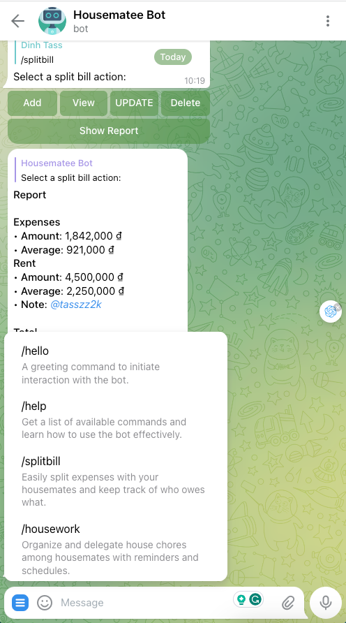
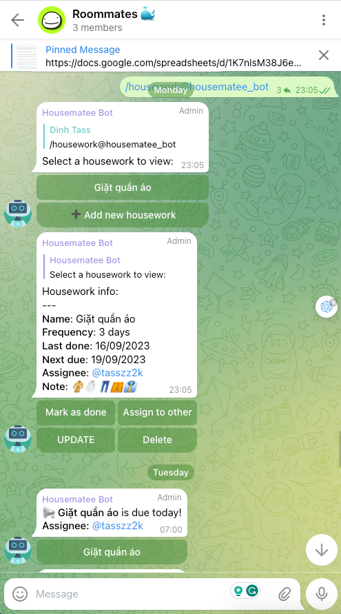
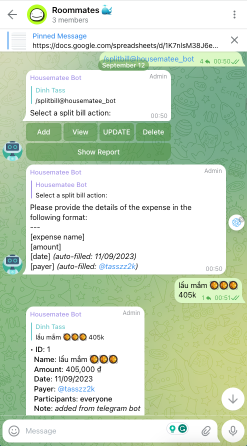

# Housematee Telegram Bot

Housematee is a Telegram bot designed to make your life with housemates easier and more organized. It allows you to
manage home bills, set reminders for housework, and more, all within the convenience of Telegram.

<style>
  .image-cell {
    width: 496px; /* Set your desired width here */
    height: 892px; /* Set your desired height here */
    overflow: hidden;
  }
  .image-cell img {
    width: 100%;
    height: 100%;
    /*object-fit: cover; !* This will crop the images to fit the fixed dimensions *!*/
  }
</style>

<table style="width: 100%;">
  <tr>
    <th>Commands</th>
    <th>Housework</th>
    <th>Split bill</th>
  </tr>
  <tr>
    <td class="image-cell"></td>
    <td class="image-cell"></td>
    <td class="image-cell"></td>
  </tr>
</table>


## Features

- **Bill Sharing**: Easily split and manage home bills among your housemates.
- **Housework Reminders**: Set reminders for housework tasks and keep your living space clean and organized.
- **Customization**: Customize Housematee to suit your preferences.
- **Feedback**: Share your feedback and suggestions with us to improve Housematee.

## Installation

1. Clone the repository:

```bash
git clone https://github.com/your-username/housematee-tgbot.git
```

## Usage

- Start a chat with Housematee bot on Telegram.
- Use the available commands to manage bills, set reminders, and more.
- Supported commands:
    - /hello - A greeting command to initiate interaction with the bot.
    - /gsheets - Manage and interact with your Google Sheets data directly from the bot.
    - /splitbill - Easily split expenses with your housemates and keep track of who owes what.
    - /housework - Organize and delegate house chores among housemates with reminders and schedules.
    - /settings - Adjust bot settings, such as language, notification preferences, and more.
    - /feedback - Provide feedback about the bot or report issues for continuous improvement.
    - /help - Get a list of available commands and learn how to use the bot effectively.
- The sample spreadsheet: [here](https://docs.google.com/spreadsheets/d/1a_etCpFf-B1woVM9qjLPM0Nzwox3KPm_ok2bSibdgJk/edit?usp=sharing)

## Project structure

```plaintext
housematee-tgbot/
│
├── config/
│   ├── config.go
│   └── config.sample.json
│
├── commands/
│   ├── splitbill/
│   │   ├── splitbill.go
│   ├── housework/
│   │   ├── housework.go
│   ├── settings/
│   │   ├── settings.go
│   └── start.go
│
├── handlers/
│   ├── splitbill_handler.go
│   ├── housework_handler.go
│   ├── settings_handler.go
│   └── start_handler.go
│
├── models/
│   ├── bill/
│   │   ├── bill.go
│   │   └── bill_helper.go
│   ├── housework/
│   │   ├── housework.go
│   │   └── housework_helper.go
│   └── user.go
│
├── services/
│   ├── gsheets/
│   │   ├── gsheets.go
│   │   └── gsheets_helper.go
│   └── utilities/
│       └── utilities.go
│
├── cmd/
│   └── main.go
│
└── README.md

```

### Explanation:

1. commands/:
    - This directory now has sub-directories for each major feature like splitbill, housework, etc. Each
      sub-directory contains the main go file and a _helper.go file for helper functions related to that command.

2. models/:
    - Similar to commands/, it now has sub-directories for each major data model like bill and housework. Each
      sub-directory contains the main go file and a _helper.go file for helper functions.

3. services/:
    - This is a new directory aimed at hosting services that can be used across the application. For example,
      Google Sheets API logic can go under gsheets/.

4. utilities/:
    - This sub-directory under services/ can contain utility functions that can be used throughout the
      application.

## TODO List

### Telegram chatbot

- [x] Configure supported
  commands: `/hello`, `gsheets`, `/splitbill`, `/housework`, `/settings`, `/feedback`, `/help`, ...
- [x] Add bot into group
- [x] Configure API token

### Google sheets

- [x] Configure Google Sheets API
- [x] Configure Google Sheets credentials

### Requirements

**Handle all commands when received**

- [x] reply to user if command is supported
- [x] reply to user if command is not supported

**Command: `/hello` handler**

- [x] Greet user

**Command: `/splitbill` handler**

- [x] show the list of buttons for bill management: `add`, `view`, `update`, 
  `delete`, `report`
    - [x] handle `add` button:
        - user input: each on a new line: `name`, `amount`, `date`, `payer`
          ```
          [expense name]: default: name - current date
          [amount]: support parse "k" -> thousand, "m" -> million
          [date]: default: current date
          [payer]: default: current user
          ```
        - add new record to Google Sheets
        - reply to user:
            ```
                Status: <status>
                --- <show data as a row of table> ---
                ID: <id> 
                Expense name: <name>
                Amount: <amount>
                Date: <date>
                Payer: <payer>
            ```
    - [x] handle `view` button:
        - show last 5 records as table
          ```markdown
                | ID | Expense name | Amount | Date | Payer |
                |:---|:-------------|:-------|:-----|:------|
                | 1  | ...          | ...    | ...  | ...   |
                | 2  | ...          | ...    | ...  | ...   |
            ```
        - show buttons: `next`, `previous`, `back` (optional)
    - [x] handle `report` button:
        - show a report as table
          ```markdown
            |                               | Amount    | ***        |
            |:------------------------------|:----------|:-----------|
            | living expenses               | 5.000.000 | 2.500.000  |
            | person1 paid                  | 1.000.000 | 1.500.000  |
            | person2 paid                  | 4.000.000 | -1.500.000 |
            | rent                          | 4.500.000 | 2.250.000  |
            | total                         | 9.500.000 | 4.750.000  |
            | gap= (total)/2-[person2 paid] | 3.250.000 |            |
          ``` 

**Command: `/housework` handler**

- Show the list of buttons for housework management: `list`, `add`, `update`, `delete`
    - [x] handle `list` button:
        - show the list of housework tasks as table
          ```markdown
            | ID | Task name | Frequency | Last done | Next due | Next assignee |
            |:---|:----------|:----------|:----------|:---------|:--------------|
            | 1  | ...       | ...       | ...       | ...      |...            |
            | 2  | ...       | ...       | ...       | ...      |...            |
          ```
        - show buttons: each task as a button, `back` (optional)
        - [x] handle `task selected` button
            - show task details
              ```
                  ID: <id> 
                  Task name: <name>
                  Frequency: <frequency>
                  Last done: <last done>
                  Next due: <next due>
                  Next assignee: <next assignee>
              ```
        - show buttons: `mark as done`, `remind housemates`, `back` (optional)
    - [ ] handle `add` button:
        - user input: each on a new line: `name`, `frequency`, `last done`
          ```
          [task name]: default: name - current date
          [frequency]: default: 1 week
          [next due]: default: current date
          [next assignee]: default: current user
          ```
        - add new record to Google Sheets
        - reply to user:
            ```
                Status: <status>
                --- <show data as a row of table> ---
                ID: <id> 
                Task name: <name>
                Frequency: <frequency>
                Last done: <last done>
                Next due: <next due>
                Next assignee: <next assignee>
            ```

**Command: `/sgheets` handler**

- [ ] show buttons: `list`, `create`, `select main sheet`, `back` (optional)
- [ ] handle `list` button:
    - show the list of sheets as table
      ```markdown
        | ID | Sheet name | Sheet ID |
        |:---|:-----------|:---------|
        | 1  | ...        | ...      |
        | 2  | ...        | ...      |
      ```
    - show buttons: `select main sheet`, `back` (optional)
- [ ] handle `create` button:
    - create a new sheet with name: `Housematee - <current month>/<current year>`
    - add new record to Google Sheets
    - reply to user:
        ```
            Status: <status>
            --- <show data as a row of table> ---
            ID: <id> 
            Sheet name: <name>
            Sheet ID: <sheet id>
        ```
- [ ] handle `select main sheet` button:

**Command: `/help` handler**

- [x] show the list of buttons for
  help: `/hello`, `gsheets`, `/splitbill`, `/housework`, `/settings`, `/feedback`, `/help`, ...

## Contributing

Contributions to this project are welcome! Feel free to open issues, submit pull requests, or provide feedback.

## License

This project is licensed under the MIT License.

